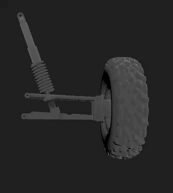
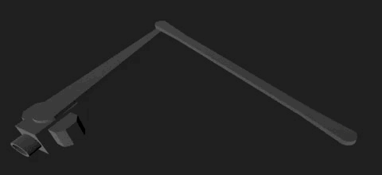

# Hi, I'm Nate!

I am a `Software Developer`, currently focused on `Embedded Programming`.

For more details on Projects, Resume, and more, go to [my website](http://www.natewake.dev).

## Current Project:

I am the `Data Acquisitions' Subsystem Lead` of CSULB's `SAE Baja Team`. I am responsible for:

* Managing the Data Aqcuisition's GitHub.
* Refactoring developed code.
* Testing the data collection methods on many points on the car
* Designing, and programming the system
* Data Analysis of collected information

### Suspension Model

Here is a model representing the suspension system that I am working on. This model helps in visualizing how different components interact during the race.

### Suspension Sensor

This is one of the sensors I manage: a suspension level sensor used to determine changes in suspension angle throughout the race. The data gathered helps improve the vehicle's performance and durability over time.

## Programming Languages:

Python ----------- 5 Years

C++ -------------- 4 Years

C ----------------- 3 Years

JavaScript ------- 2 Years

SQL -------------- 2 Years
